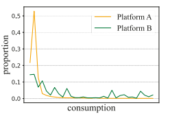

# Cross-Domain Adaptative Learning for Online Advertisement Customer Lifetime Value Prediction
## 概述
顾客终身价值（LVT）会极大影响在线广告平台的收入，但是在实际场景中用户历史消费数据数量较小，很难从数据中提取足够的信息来做出准确的预测、决策或模型训练。往往会出现下列问题：
- 过拟合风险
- 泛化能力较差
- 样本偏差，数据太少，不足以代表总体分布

为了克服这个问题，自然想到先在数据量充足的平台（*source domain*）上训练一个模型，再将该模型经过改进应用到数据量不足的平台（*target domain*）上来预测LVT。
> 同时需要注意，不能直接用原领域的模型来预测现领域，因为当领域（具体本文而言是在线广告平台）变化时，消费数据的分布也会变化，直接使用原数据训练的模型偏差可能会很大，这也是为什么不能使用单纯的监督学习模型来训练目标领域模型的原因。两个平台分布示例如下：

## 具体实现
提出了**cross domain adaptation framework：CDAF**来克服数据不足的问题，它可以同时学习领域无关信息（用户的消费水平和内在特征），领域内在信息（可以确定领域消费分布的特征，比如用户消费偏好）。
具体实现：
1. 首先在数据充足的平台上训练source-model，用source-model的权重来初始化target-model（目标模型）
2. 微调经过初始化的模型，同时在经过嵌入层时，对齐两个域的用户id，用来保证领域无关信息的学习
3. 设计双预测器，分别使用源数据和目标数据，同时使用最小化Wasserstein distance的优化方法来利用领域无关和领域内在信息
4. 最终LTV预测值使用双预测器结果的平均值

### 提出的主要方法
1. 预训练源领域模型
2. Wasserstein距离最小化
3. 双预测器优化方法

对应源预测器的优化方法如下：
$$
\begin{aligned}
\mathcal{L}_{t}^{s}& =\mathcal{L}_\text{CrossEntropy}{ ( 1 _ { \{ y _ s > N \} };p_s)} +1_{\{y_{s}>N\}}\mathcal{L}_{\mathrm{Lognormal}}(y_{s};\mu_{s},\sigma_{s}),
\end{aligned}
$$ 
目标预测器优化方法相同，同时也使用了最小化源预测器和目标预测器输出$l_1$距离的优化方法：
$$
\mathcal{L}_d=\dfrac{1}{K}\sum_{i=1}^K|(p_s,\mu_s,\sigma_s)_i-(p_t,\mu_t,\sigma_t)_i|
$$

结合上述优化方法，最终使用的总优化公式为：
$$
\mathcal{L}_{a}=\lambda_{j}\mathcal{L}_{j}+\lambda_{s}\mathcal{L}_{t}^{s}+\lambda_{t}\mathcal{L}_{t}^{t}+\lambda_{d}\mathcal{L}_{d}
$$
> 其中$\lambda_{j,s,t,d}$均为超参数，在论文后续也比较了超参数的不同取值对结果的影响，应该根据数据集的不同取对应的超参数

## 实验
结果比较以AUC和Gini为评估指标
1. 比较了只在目标域训练和测试的多个模型，利用CDAF在两个域上进行训练和测试的结果，证明了CDAF的有效性
2. 比较了直接进行微调和CDAF的结果，证明同时学习领域内在和无关知识的有效性
3. 框架模块分离实验，分别去掉框架中的各个模块，以探讨模块对实验结果的贡献大小
4. 超参数实验，探究$\lambda_{j,s,t,d}$取值对实验结果的影响
## 补充知识
### Wasserstein discrepancy 
Wasserstein距离（Wasserstein distance），也被称为Wasserstein度量、Wasserstein距离、Earth Mover's Distance（EMD）等，是一种用于度量两个概率分布之间的差异的数学方法。

Wasserstein距离衡量了将一个概率分布转换成另一个概率分布所需的最小代价。这个代价通常被解释为将一个分布中的一组质量从一个位置移动到另一个位置的最小成本，其中质量可以是物体、能量或其他类型的资源。因此，Wasserstein距离可以被视为一种"运输"或"搬运"两个分布之间的代价[^1]。

$$W\left(P_{1}, P_{2}\right)=\inf _{\gamma \sim \Pi\left(P_{1}, P_{2}\right)} \mathbb{E}_{(x, y) \sim \gamma}[\|x-y\|]$$
本文中对应双预测器最小化的公式：
$$
\begin{gathered}
\mathcal{L}_{j} =\inf_{\gamma\in\Pi\left(\mathbb{P}_{e_{s}},\mathbb{P}_{e_{j}^{s}}\right)}\mathbb{E}_{\left(e_{s},e_{j}^{s}\right)\sim\gamma}\left[\left\|e_{s}-e_{j}^{s}\right\|\right] \\
+\inf_{\gamma\in\Pi\left(\mathbb{P}_{e_s},\mathbb{P}_{e_j^t}\right)}\mathbb{E}_{\left(e_s,e_j^t\right)\sim\gamma}\left[\left\|e_s-e_j^t\right\|\right], 
\end{gathered}
$$
由于Wasserstein距离很难计算，在本文中使用了sliced Wasserstein distance的方法进行计算：
1. 若为高维数据，则随机投影到128维的低维空间
2. 对两个向量排序（使用topk函数）
3. 计算均方差
> 代码中进行了两次平均

### CTR
click through rate model：一类用于估计在线广告或推荐系统中用户点击广告或推荐内容的概率的模型。这些模型的目标是根据用户的特征和广告（或内容）的特征，预测用户是否会点击广告或内容。具体的CTR模型有多种应用，代码中使用了一个全连接层来作为特征提取层

### Gini

[^1]:https://zhuanlan.zhihu.com/p/353418080