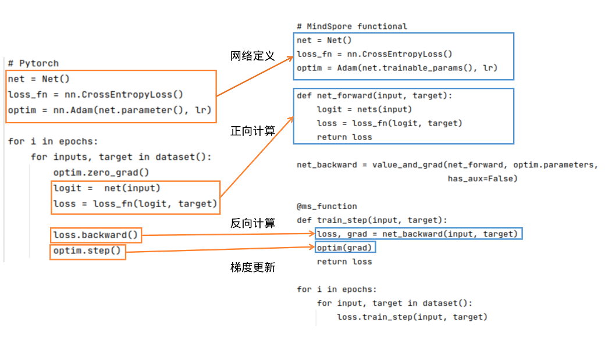

# 迁移日志
## api修改
### import 修改
```python
# import torch
# from torch import nn
import mindspore
from mindspore import nn
from mindspore import ops
```
### torch.xxx 修改
通过查询[api映射表](https://www.mindspore.cn/docs/zh-CN/master/note/api_mapping/pytorch_api_mapping.html)，`torch.xxx`的常见操作都被转移到`mindspore.ops.xxx`。
例如：
```python
proj = torch.randn(p1.shape[1], 128)
proj *= torch.rsqrt(torch.sum(proj**2, dim=0, keepdim=True))
p1 = torch.matmul(p1, proj)
p2 = torch.matmul(p2, proj)
```
查询api映射表之后，上述api均可以对应mindspore的同名api，参数也相同
### api修改
- 有些api对应的函数名有所修改，例如`return sorted_matrix_T.swapaxes(0, 1)`，且 torch 网络结构中的 Linear（全连接层） 对应 mindspore 的 Dense，`nn.Dense(self.input_dim, self.hidden_dim)`
- 在保存和加载模型方面，torch和mindspore大致相同，但是函数有所区别，由原来的`load`和`save`修改为`load_checkpoint`和`save_checkpoint`，并且还需要`load_param_into_net`将参数加载进模型

## 重写训练函数
torch和mindspore的对比如[下图](https://www.mindspore.cn/docs/zh-CN/master/migration_guide/typical_api_comparision.html):

在PyTorch和MindSpore在实现流程中一般都需要网络定义、正向计算、反向计算、梯度更新等步骤。

- 网络定义，在PyTorch的网络继承nn.Module；类似地，MindSpore的网络继承nn.Cell，pytorch中的forward函数对应mindspore的construct函数；
- 正向计算，运行实例化网络后可以得到out（logit），将logit和target作为输入计算loss
- 反向计算，得到loss后，我们可以进行反向计算。在PyTorch中可使用`loss.backward()`计算梯度，在MindSpore中，先用`mindspore.grad()`定义出反向传播方程net_backward，再将输入传入net_backward中，即可计算梯度
- 梯度更新，将计算后的梯度更新到网络的Parameters中。在PyTorch中使用`optim.step()`；在MindSpore中，将Parameter的梯度传入定义好的optim中，即可完成梯度更新。